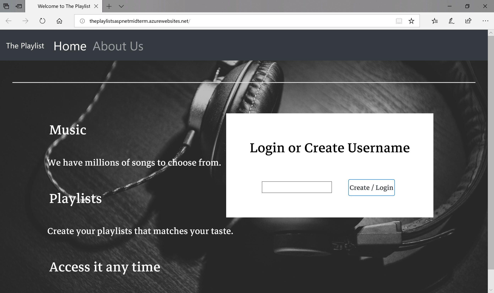
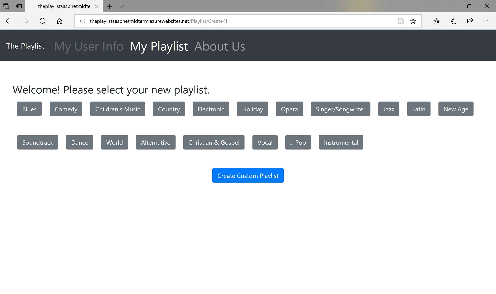
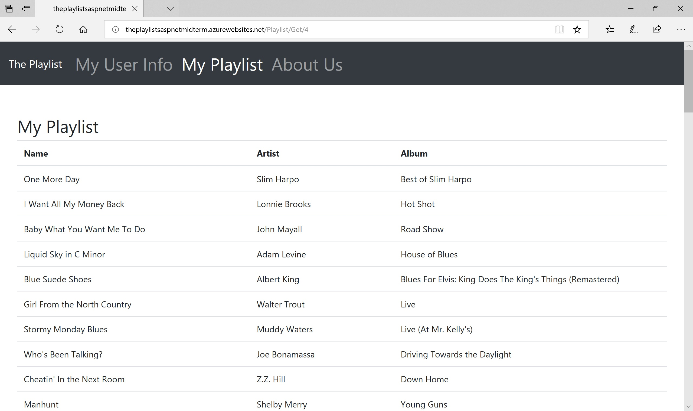
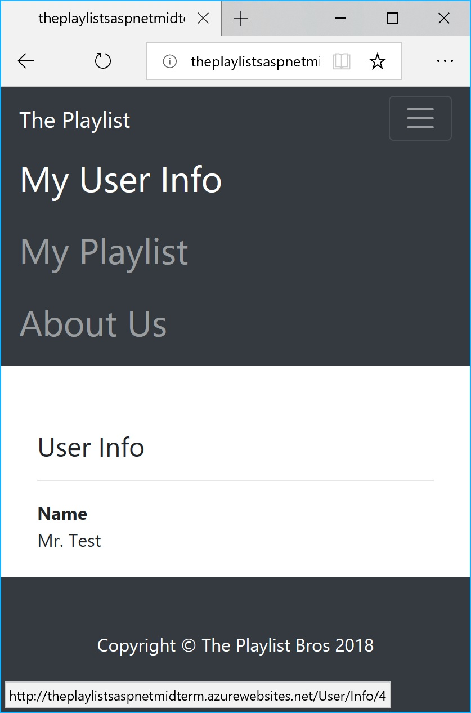
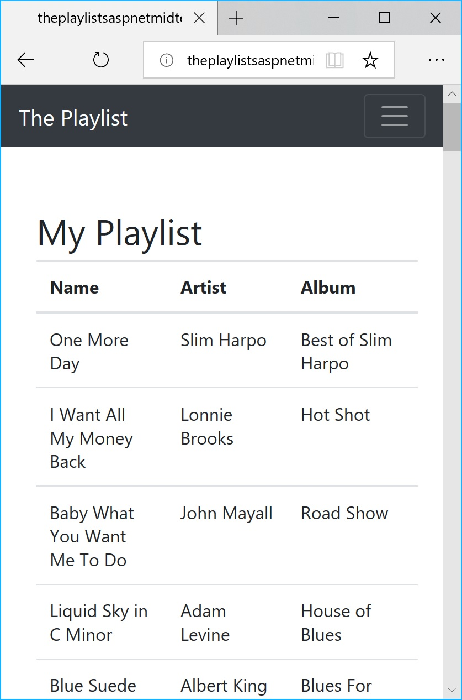

# Web-Application
 Code Fellows 401 C#/ASP.NET course midterm project

**Authors**: Andrew Baik, Collin Hintzke, Jimmy Chang, Earl Jay Caoile  
**Version**: 1.0.0

## Overview
This MVC web application allows users to create an account and generate a default playlist based on their preferences or a randomized playlist.

## Getting Started
The following is required to run the program.
1. Visual Studio 2017 
2. The .NET desktop development workload enabled
3. ASP.NET web API packages

## Visuals
- 
- 
- 
- 
- 

## Architecture
This application is created using ASP.NET Core 2.1 Web Application  
*Languages*: C#, HTML, CSS  
*Tools*: Azure, Visual Studio Team Services, SQL Database, Bootstrap  
*Type of Applicaiton*: Web Application  

## Change Log
06-29-2018 9:00 AM - initial scaffolding  

**Monday**  
07-02-2018 9:00AM - Project began, initial Hello World deployed on Azure, worked on user stories and creating tasks  
07-02-2018 1:00PM - scaffolded and created basic models of songs, playlists, and users  
07-02-2018 5:00PM - created the first controller 

**Tuesday**  
07-03-2018 9:00AM - completed first controller (user)  
07-03-2018 1:00PM - received first API example for testing purpose  
07-03-2018 5:00PM - refactored our controllers  

**Wednesday**  
4th of July / Day off   

**Thursday**  
07-05-2018 9:00AM - finished writing the outline for 2 controllers (user/playlist)  
07-05-2018 1:00PM - received full JSON strings from API for testing purposes  
07-05-2018 5:00PM - debugged our methods for final product  
07-05-2018 10:00PM - pushed to master with our final product  

